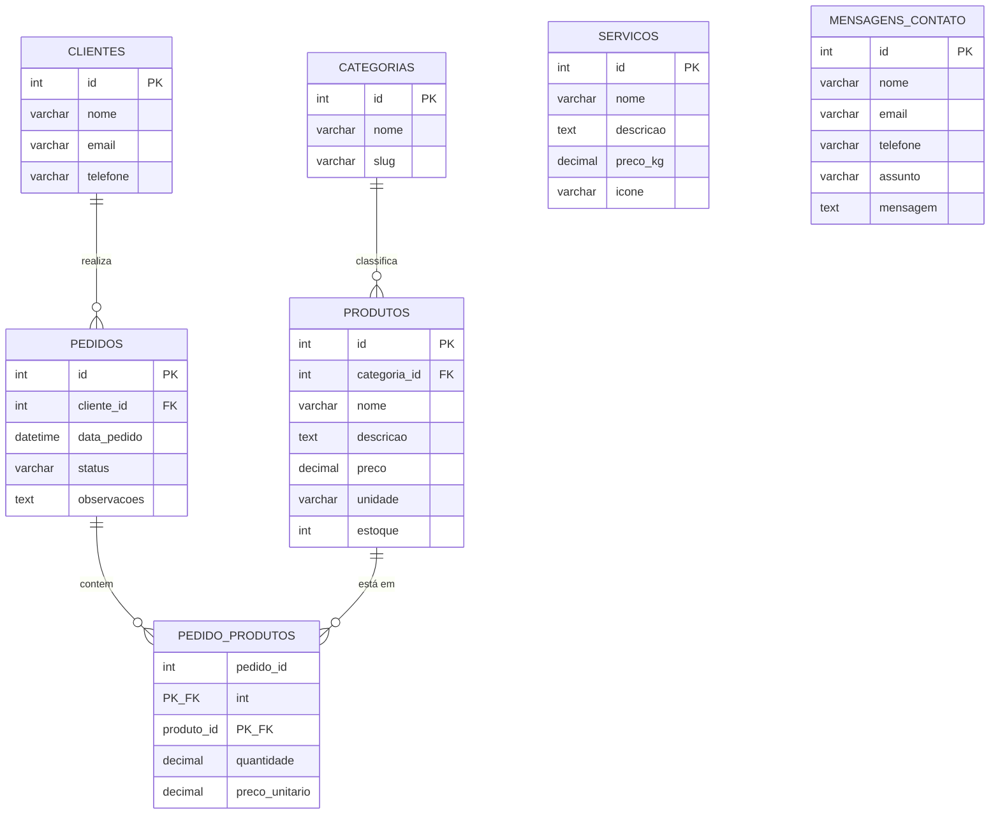

# Diagrama de Entidade Relacionamento - Assadão do Zé

Este diagrama representa a modelagem do banco `assadao_do_ze` (script completo em [`banco.sql`](./banco.sql)).

**Chaves estrangeiras:** `produtos.categoria_id → categorias.id`, `pedidos.cliente_id → clientes.id`, `pedido_produtos.pedido_id → pedidos.id`, `pedido_produtos.produto_id → produtos.id`.

**Relacionamento N:N:** `PEDIDOS` ↔ `PRODUTOS`, resolvido pela tabela associativa `PEDIDO_PRODUTOS` (chave primária composta).
